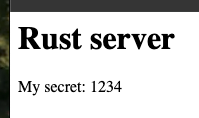
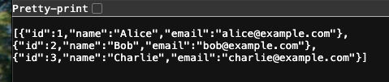

# Deploy Rust to Azure Container Apps

This application is a simple Rust application, with steps to deploy to Azure Container Apps. 

The Rust app uses the Axum web server. The server has a root route returning HTML and a `/api/users` route returning JSON data. 

The app has 2 _secrets_ to demonstrate how to use those secrets in the Axum app and in the deployment process. 

* PORT=3000
* MY_SECRET=1234

## Deploy

1. Copy `sample.env` to `.env` file. Fill out with port and secret. Secret is just an example of any secret.
1. In terminal at root of project, run `az login` to sign into Azure CLI.
1. In terminal at root of project, run `azd login` to sign into Azure Developer CLI.
1. In terminal at root of project, run `gh auth login` to sign into GitHub.
1. In terminal at root of project, run `bash ./scripts/azd-provision-with-environment.sh`. This creates the Azure resources and copies a few key environment variables from the privisioning process into the root `.env`. 
1. In terminal at root of project, run `bash ./scripts/create-github-azure-credentials.sh`. This creates the secrets you need to deploy from the GitHub workflow file, `./.azure/workflows/build-and-deploy.yaml`, and adds them to your GitHub repo. 
1. Go to the GitHub repository and trigger the workflow manually to deploy to Azure Container Apps.
1. In **a new terminal** at root of project, run `bash ./scripts/stream-logs.sh` to see the Rust Axum server logs as requests are made. 
1. In terminal at root of project, run `bash ./scripts/get-url.sh`. This displays the URL to access your app. 
1. Paste the URl in a browser to see the app. 

  

1. Add `/api/users` to the the JSON results

  


## Azure resources

This Azure resources used in this project include:

* Azure Container registry
* Azure Container Apps Environment
* Azure Container App
* Managed Identity
* Shared dashboard
* Application Insights

## CLIs

This repo uses several CLIs to simplify the provisioning and deployment process to Azure. This CLIs can be used with any programming language, including Rust: 

* Azure CLI: the Azure CLI has a large scripting surface to interact with Azure resources, including creation, configuration, and streaming logs.
* Azure Developer CLI: the Azure Developer CLI supports provisioning and deployment for .NET, Java, Python, and JavaScript. This project uses the provisioning functionality, which is language agnostic, to create and configure the Azure resources using Bicep templates. 
* GitHub CLI: the GitHub CLI is used to configure the repo deployment secrets. 

This functionality is wrapped in bash scripts in the `./scripts` directory. 

## Using VS Code REST Client

For testing your HTTP endpoints, it's recommended to use the [REST Client extension for VS Code](https://marketplace.visualstudio.com/items?itemName=humao.rest-client). The repository contains an [http](http://_vscodecontentref_/1) folder which includes sample HTTP request files (e.g., `sample.http`). You can use these files to easily send requests directly from VS Code.

Additionally, create your local [.env](http://_vscodecontentref_/2) file based on the [sample.env](http://_vscodecontentref_/3) provided in the [http](http://_vscodecontentref_/4) folder. This file stores your environment variables needed for testing. Simply copy or rename [sample.env](http://_vscodecontentref_/5) to [.env](http://_vscodecontentref_/6) and adjust values as necessary.

## Alternative Rust Backend API Servers

If you'd like to explore different Rust web frameworks for your backend API server, consider trying out these sample repositories:

- **Actix-Web**: Check out the [Actix Web Examples](https://github.com/actix/examples) for various application samples.
- **Rocket**: Explore the [Rocket Examples](https://github.com/SergioBenitez/Rocket/tree/v0.5-rc/examples) to see how Rocket can be used for backend development.
- **Warp**: Review the [Warp Examples](https://github.com/seanmonstar/warp/tree/master/examples) for a lightweight, composable alternative.

Feel free to swap out the current implementation with any of these frameworks to better suit your project's needs.

## Remove resources

When you are ready to remove your resources from Azure, use the following Azure Developer CLI command:

```bash
azd down --purge
```

## Troubleshooting

If you can't complete all of the deploy steps successfully, [log an issue](https://github.com/dfberry/rust-on-azure-container-apps/issues) with the following:

* You should only need to copy `sample.env` files into `.env` files. 
* What host operating system did you use such as Windows, Mac, or Linux. Include version and flavor -- as much information as possible.
* What type of Azure subscription you are deploying to. 
* Which step didn't complete and what error you got in the process.
* What debug/fix steps you took. 
* If you made any changes to one of the following directories, explain why you needed to make that change to try out the sample in order to deploy it:
  * ./src
  * ./infra
  * ./devcontainer
  * ./github/workflows
  * ./http
* If you swapped out another Rust application in order to use the provisioning and deployment, what did you swap out? Can you link to a public repo of that framework or your source code? 